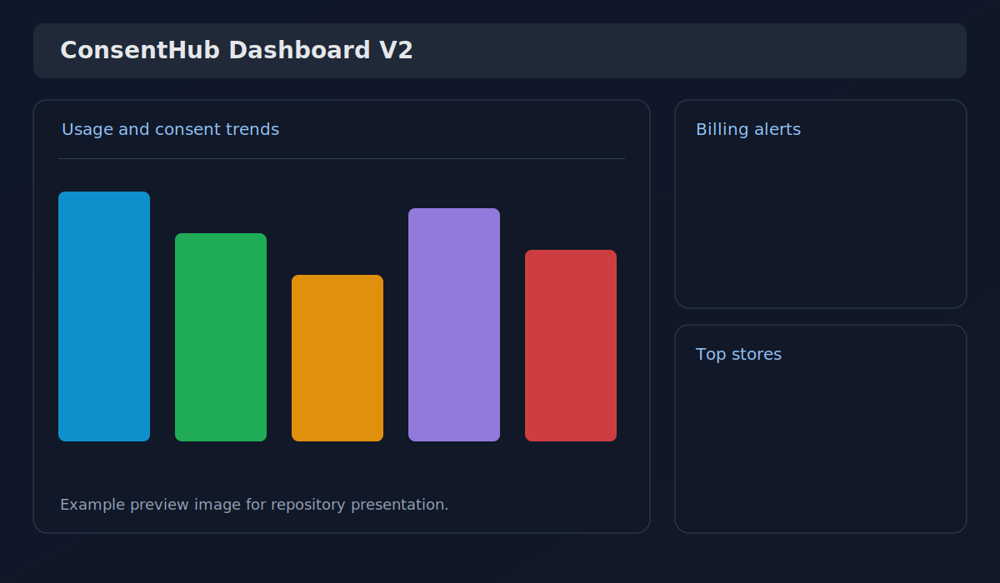
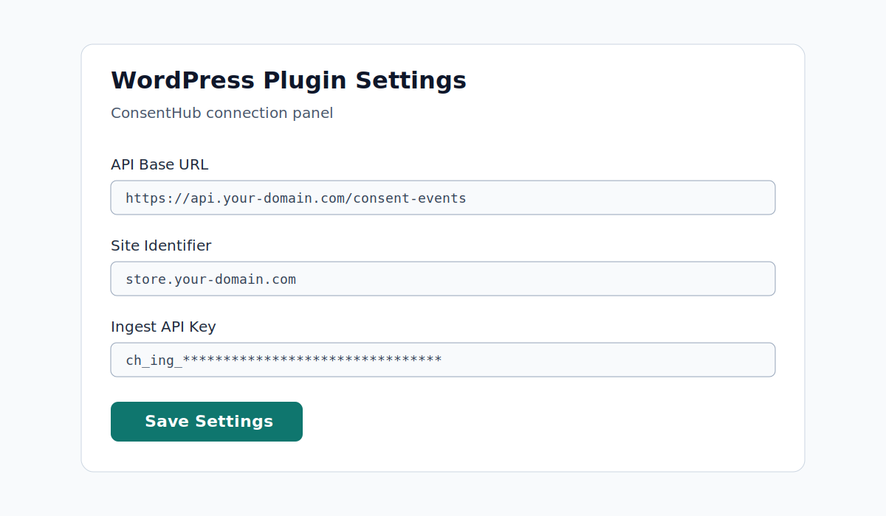
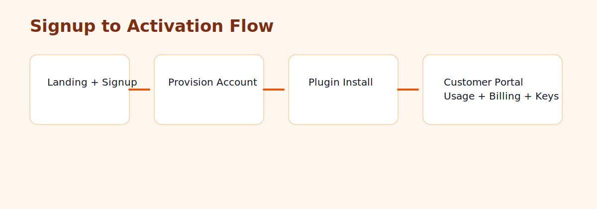

# ConsentHub

ConsentHub helps ecommerce teams collect, audit, and export consent events without slowing down checkout or product delivery.

## What Problem It Solves

If you run stores in LATAM/EU, you need proof of consent decisions, quick exports for audits, and operational control over plan limits and billing states.

ConsentHub gives you:

- Consent event ingestion API with scoped credentials.
- Customer-facing portal for usage and credential management.
- Billing-aware plan enforcement (limits, grace period, downgrade behavior).
- Privacy endpoints for subject data access/export/deletion.

## Who It Is For

- Ecommerce teams on WordPress.
- Agencies managing multiple stores.
- SaaS operators who need a consent backend with billing and ops controls.

## Product Snapshot

### Dashboard



### WordPress Plugin Setup



### Signup to Activation Flow



## Install in 5 Minutes

1. Start backend:

```bash
cd apps/saas
cp .env.example .env
npm install
docker compose up -d
npm run prisma:generate
npm run db:push
npm run dev
```

2. Open the product landing at `http://localhost:8787/`.
3. Create a customer via signup (`/signup`) or onboarding API.
4. Install plugin from `apps/wordpress-plugin/consenthub-espanol` in WordPress.
5. Follow plugin docs at `http://localhost:8787/docs/plugin-install`.

## Core URLs

- Public landing: `/`
- Public signup: `POST /signup`
- Plugin install docs: `/docs/plugin-install`
- Customer login: `/auth/login`
- Customer portal: `/customer-portal`
- Dashboard V2 (admin): `/dashboard-v2`

## Repository Structure

- `apps/saas`: SaaS backend (API, auth, dashboard, billing, onboarding).
- `apps/wordpress-plugin/consenthub-espanol`: WordPress plugin.
- `apps/saas/docs`: operational and deployment docs.

## Deployment

- Render blueprint: `apps/saas/render.yaml`
- Deploy guide: `apps/saas/docs/deploy-render.md`
- Production env validation: `cd apps/saas && npm run verify:prod-env`

## Current Capabilities

- Scoped API credentials stored hashed at rest.
- Magic-link auth with CSRF-protected web actions.
- Optional SSO bridge and native OIDC login.
- Stripe checkout/webhook/portal integration.
- Billing alerts, escalation, and incident exports.
- Privacy endpoints for subject-level requests.
- Onboarding endpoints and customer portal flows.

## Roadmap (Near Term)

- Publish real product screenshots/GIF from live environment.
- Add public docs site (FAQ + troubleshooting + integrations).
- Add DNS domain verification for onboarding trust.

## Release

- Latest release notes: `apps/saas/RELEASE_NOTES.md`

## License

Proprietary for now (update when distribution policy is finalized).

1. Abre el sitio en frontend.
2. Interactua con el banner.
3. Verifica eventos:

```bash
curl -H 'x-api-key: dev-key-change-me' 'http://localhost:8787/consent-events?site=tu-dominio.local'
```

4. Export CSV:

```bash
curl -H 'x-api-key: dev-key-change-me' 'http://localhost:8787/consent-events/export.csv?site=tu-dominio.local'
```

Nota: los endpoints API de eventos y export usan API key solo por header `x-api-key`.

## Siguientes hitos

- Dashboard frontend separado (no SSR en string) para evolucion de UX.
- Refinar capacidades enterprise: SSO/RBAC avanzado y multi-tenant admin.
- Performance budgets por endpoint y pruebas de carga periodicas.
- Expandir resiliencia de datos (retencion offsite/cifrado y drills de restauracion cruzada).

Nota: gran parte del hardening operativo ya fue implementado en `apps/saas` (observabilidad, CI gates, runbooks, backup/restore/drill).

## Nota legal

ConsentHub facilita implementacion tecnica y buenas practicas. No constituye asesoria legal.
